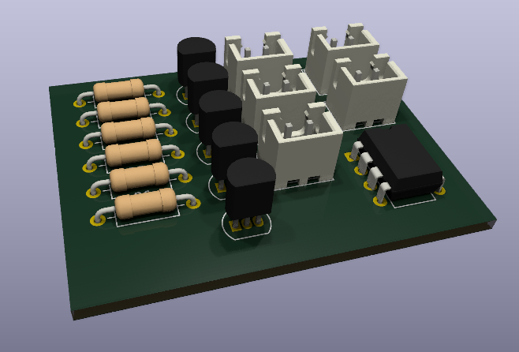

# PIC12F675 LED Dimmer

-green)

> **Nota:** Este proyecto ha sido migrado al **ARCHIVE**. Representa una base estable de control de potencia y gestión de recursos limitados en sistemas embebidos.

## 🚧 Avance Actual: Diseño de PCB y Modelado 3D
Actualmente, he finalizado el esquema lógico y la disposición de componentes principales. El siguiente paso es la integración de un módulo Buck Step-Down personalizado (LM2596) modelado en FreeCAD para mejorar la eficiencia térmica.

### Captura del Layout Preliminar
Aquí puedes ver la disposición actual de los transistores 2N2222A y los conectores JST para las 5 salidas LED.

---

## 📝 Descripción
Controlador de intensidad (Dimmer) de 5 canales para tiras LED de 12V, basado en el microcontrolador PIC12F675. 

* **Control:** PWM generado por software.
* **Potencia:** Transistores 2N2222A en configuración de conmutación.
* **Eficiencia:** Integración de regulador Buck LM2596 para reducir de 12V a 5V sin generar calor excesivo.

### 📂 Documentación de Hardware
Para una revisión detallada de las conexiones y el diseño electrónico, puedes consultar el diagrama técnico:
* 📄 [Ver Esquemático (PDF)](./hardware/pic12f675-led-dimmer/pic12f675-led-dimmer.pdf)

---

## 🧠 Firmware
El núcleo del sistema está escrito en **C** y optimizado para el PIC12F675 utilizando el compilador **XC8**.

* **Arquitectura:** Basada en interrupciones para una gestión eficiente del PWM.
* **Módulos clave:** * Gestión de 5 canales de salida mediante conmutación rápida.
    * Configuración de registros internos (Oscilador, GPIO, Timers).
* **Código Fuente:** [Ver src/main.c](./src/main.c)

---

## 🛠️ Herramientas utilizadas
* **Firmware:** C (XC8 Compiler), MPLAB X.
* **Diseño PCB:** KiCad 8.0.
* **Modelado 3D:** FreeCAD (integración paramétrica).
* **Automatización:** `Makefile` para compilación y gestión de assets.
* **Documentación:** LaTeX para el reporte de investigación.

---

## 📁 Estructura del Proyecto
* `/src`: Código fuente en C y artefactos de compilación (`.hex`).
* `/hardware`: Archivos de diseño de KiCad 8.0 y exportaciones PDF.
* `/docs`: Datasheets e investigación técnica detallada en LaTeX.
* `/simulation`: Archivos de simulación para validación lógica previa.
* `Makefile`: Automatización de la compilación del firmware.

---

## 🚀 Compilación y Uso
El proyecto utiliza un `Makefile` para automatizar las tareas:
* `make`: Compila el código fuente y genera el `.hex`.
* `make clean`: Limpia los archivos temporales de compilación.

---

## ✅ Resultados y Pruebas
El sistema ha sido validado físicamente con los siguientes resultados:
* **Estabilidad Térmica:** El regulador Buck LM2596 mantiene una temperatura operativa estable bajo carga completa (5 tiras LED).
* **Respuesta PWM:** Conmutación limpia sin parpadeo perceptible, optimizada mediante la gestión de registros del Timer0.
* **Integración Mecánica:** El modelo 3D de FreeCAD permitió un ensamble preciso dentro de la carcasa final.

## 📜 Licencia y Autoría
Este proyecto fue desarrollado íntegramente por **Marcos Bernard Calixto**.
* **Copyright:** © 2026 - No License Granted - All Rights Reserved.

---
*© 2026 MB
